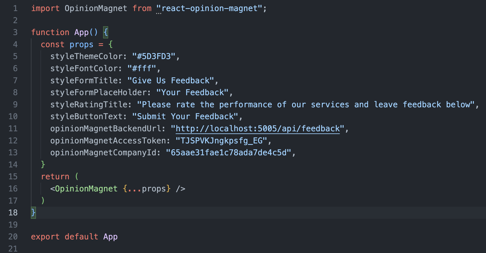
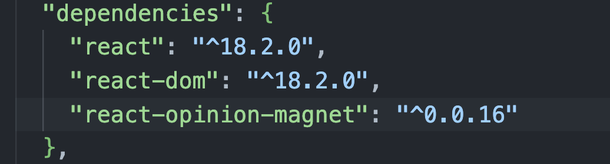

## How to install component
You should run `npm install react-opinion-magnet`

### How it works 
In the below picture you can see all related adjustments for the app.jsx file.
Customize the package content to match the style of your current page,including adjustments such as measurements.

Please ensure that reac-opinion-magnet has already existed in your package.json file.
You can find picture as below.

### DEMO FEEDBACK APPLICATION
If you wish to see how it will appear in your system, the following link can provide insights.
* opinion-magnet-demo: https://codesandbox.io/p/github/zsaritek/opinion-magnet-demo

### BACK END AND ADMIN UI DASHBOARD
* api: https://api-opinion-magnet.adaptable.app/api
* admin dashboard: https://opinion-magnet.adaptable.app

You can login to demo account as a user `admin@acme.com` and password `123456`
     
